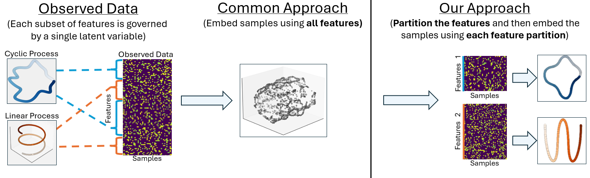
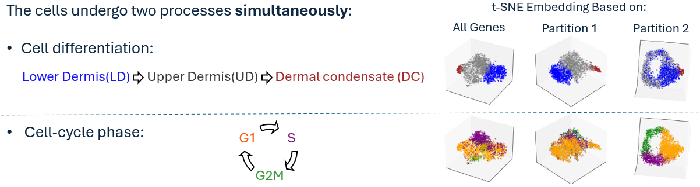
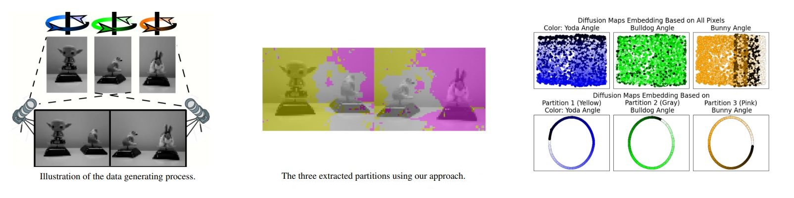

## **Partition First, Embed Later: Laplacian-Based Feature Partitioning for Refined Embedding and Visualization of High-Dimensional Data**  
📌 Oral + Spotlight Poster at ICML 2025

🧑‍💻 **Erez Peterfreund, Ofir Lindenbaum, Yuval Kluger, Boris Landa**  

> ⚠️ **Note (July 25, 2025):** This repository is a partial release. We are in the process of uploading the remaining notebooks and full experimental setup. Everything will be available by **August 1, 2025**.

📄 Read the full paper:
https://openreview.net/forum?id=6CwO5nVvku

For questions or collaborations, please open an issue or email erez.peterfreund@yale.edu.

---


## ✨ Overview

Feature Partitioning (FP) splits the features into mutually exclusive groups, thus generating multiple views of the samples. Each group of features is associated with a different latent variable that governs the data, such as a biological process, spatial location, or time.

In this paper, we focus on embedding: Instead of producing a single complex embedding that will mix all the latent variables together, by using FP we can generate multiple simpler embeddings, each corresponding to a single latent variable.

This allows for:

1. Clearer and more interpretable low-dimensional visualizations

2. Separation of biological or physical processes

While our primary application is embedding, the learned feature partitions can also support other downstream tasks, such as: including clustering, trajectory inference, or regression, applied independently to the samples based on each partition.

<figure><p align="center">
   </p>
<figcaption align="center"><b>Fig 1.</b> (Left) The observed data and standard embedding methods (UMAP, t-SNE, Laplacian Eigenmaps),  which mix all latent variables into a single representation.
(Right) Our approach first partitions the features to construct multiple views of the samples, and then computes a separate embedding for each view.
 </figcaption> </figure>

---

## 💡How do we do this?

To partition the features, we propose solving an optimization problem that promotes graph Laplacian-based smoothness in each partition, thereby prioritizing partitions with simpler geometric structures. Our approach generalizes traditional embedding and visualization techniques (like t-SNE, UMAP and LE), allowing them to learn multiple embeddings simultaneously.


---


## 🧪 Results


### 🧬 Biological Data

Consider a dataset of cells that undergoes two biolgoical process. Below we compare the embedding generated based on all genes, with the embeddings generated based on two gene partitiosn that were extracted using our approach. The color in each row encodes the cell stage in each of the corresponding biological processes.

**Common approach**: Embed cells using all genes → embedding reflects mainly a single biological process

**Our approach**: First partition the genes and only then embed the cells based on each genes group → clean, interpretable embeddings that track each biological process

<figure> 
<p align="center">
  
</p>
<figcaption align="center"><b>Fig 2.</b> (Left) The two biological processes governing the cells, with each stage color-coded.
(Right) t-SNE embeddings of the cells based on all genes and on the two gene partitions identified by FP. Colors in each row correspond to cell stages within the respective biological process shown on the left.
 </figcaption>  </figure>

### 🖼️ Image Data

Consider a video of three rotating puppets (example in the image below). 

**Common approach**: Embed images using all pixels → embedding reflects a "mixed" signal

**Our approach**: First partition the pixels and only then embed the images based on each pixels group → clean, interpretable embeddings that track each puppet's rotation

<p align="center">
  
</p>
<figcaption align="center"><b>Fig 3.</b> (Left) Illustration of the data-generating process: two cameras capture three rotating figurines, and their outputs are concatenated into a single image.
(Middle) The three partitions extracted using FP.
(Right) Embeddings computed using all pixels and those computed separately from the three pixel partitions identified by FP. In each column, the embedding is colored according to the azimuth of a different figurine.
 </figcaption>  </figure>


---

## 📦 Installation

```bash
git clone https://github.com/erezpeter/Feature_Partition.git
python setup.py build_ext --inplace
````


---

## 🔧 Language Support
This repository currently provides a Python implementation of the Feature Partitioning algorithm.

We are actively working on:

🔜 An R version for users in the statistical and bioinformatics communities

🔜 A PyTorch-based version for GPU acceleration and deeper integration into deep learning workflows

If you would like to be notified when these versions are released, feel free to email us at erezpeter@gmail.com and we’ll keep you updated.


---

## 🛠️ How to Use the `FP` Class

```python
from fp_algorithm import FP
from sklearn.manifold import TSNE

# Step 1: Initialize FP model with 2 partitions
model = FP(K=2, perplexity=30)

# Step 2: Fit the model to data X
# X can be either:
# - the raw data matrix of shape (N samples × D features), or
# - a low-rank SVD decomposition tuple (U, D, VT), where:
#     U ∈ R^{N×S}, D ∈ R^S, VT ∈ R^{S \times D}, and S is the number of retained components
model.fit(X, verbose=True, simulations=3)

# Step 3: Get feature partitions
partitions = model.get_feature_partitions()

# Step 4: Embed each feature partition using t-SNE (or another embedding method)
# Here we map the data restricted to each feature partition into 3D space using t-SNE
emb_FP = [ TSNE(n_components=3, perplexity=40, random_state=42).fit_transform(x[:,partitions[s]]) for s in range(K) ]

```

### 🧭 Intuition for Parameters

| Parameter     | Description                                             |
| ------------- | ------------------------------------------------------- |
| `K`           | Number of partitions (e.g., 2 for trajectory vs cycle)  |
| `perplexity`  | Similar to t-SNE: controls neighborhood size            |
| `simulations` | Number of random restarts to avoid local minima         |
| `is_parallel` | A boolean indicating whether to parralize the affinities comptutation|
| `block_size`  | Controls parallel computation of affinities             |
| `delta_steps` | Gradually removes regularization for sharper partitions |


---

## 📄 Citation

If you use this code, please cite:

```bibtex
@inproceedings{peterfreund2025partition,
  title     = {Partition First, Embed Later: Laplacian-Based Feature Partitioning for Refined Embedding and Visualization of High-Dimensional Data},
  author    = {Peterfreund, Erez and Lindenbaum, Ofir and Kluger, Yuval and Landa, Boris},
  booktitle = {International Conference on Machine Learning (ICML)},
  year      = {2025}
}
```
